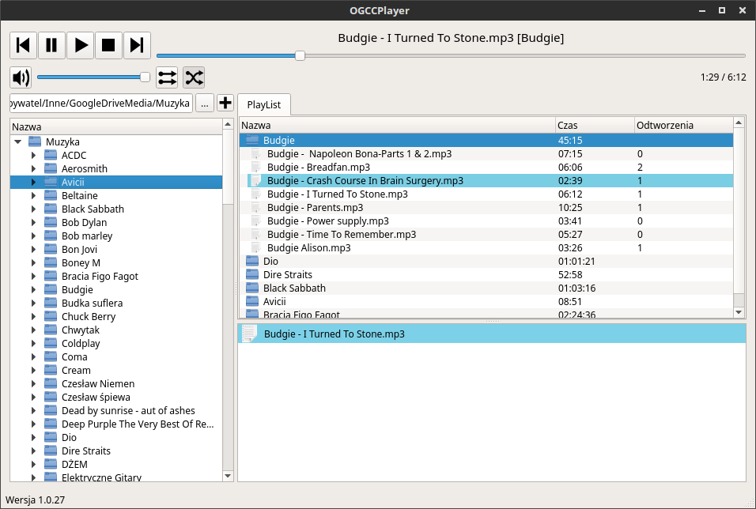

# OGCCPlayer #

Music player created to work with directory structure where folder names correspond to artist names.
OGCCPlayer was written in Qt 4.8 and [bass](http://www.un4seen.com/) library.

## Shortcuts

 - Space - play/resume song
 - P - pause song
 - J - previous song
 - K - next song
 - S - stop
 - R - random order
 - E - sequence order
 - Q - add song to queue

### Installation on Linux
1. Go to _bass_ directory
2. Copy bass.h to /usr/local/include/
3. Create /usr/local/lib/bass24 directory
4. Copy libbass.so to /usr/local/lib/bass24

## FAQ

1. cannot find -lGL

Install libgl1-mesa-dev
`sudo apt-get install libgl1-mesa-dev`